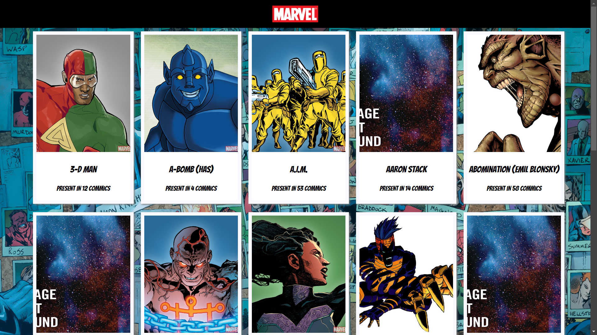
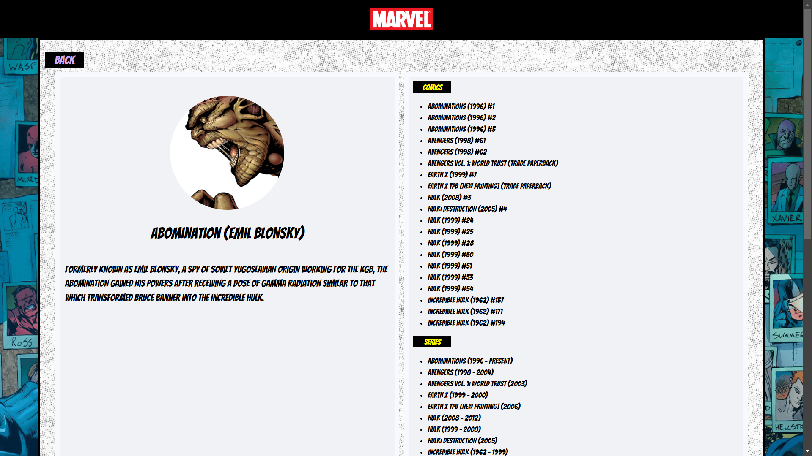

Crea un pequeño proyecto que te permita consumir las siguentes APIs

Nota: los valores de TS, PUBLIC_KEY Y HASH los puedes encontrar en el folder

```
    src/const/api.js
```

Lista los personajes de Marvel

```
    http://gateway.marvel.com/v1/public/characters?ts=${TS}&apikey=$`{PUBLIC_KEY}&hash=${HASH}
```

Detalles de un personaje

```
    http://gateway.marvel.com/v1/public/characters/${caracterId}?ts=${TS}&apikey=${PUBLIC_KEY}&hash=${HASH}
```

Puedes iniciar tu proyecto con los siguientes comandos

```
    npm install
    npm run dev
```

Las siguientes imagenes te muestran un pequeño mock del sistema requerido.

Main


Details


Results



